# AIRuler

초고해상도 스마트폰 카메라 한 대로 타발 필름의 **외관(타공부 불량)과 치수**를 검사하는 Android 앱입니다.
갤럭시 S25 Ultra 한 대가 카메라·연산 장치·표시 장치 역할을 모두 하며, 50 MP 측정은 스마트폰에서,
200 MP 측정은 공장 내 엣지 서버에서 처리하는 **단말-엣지 협력 처리** 구조로 동작합니다.

- 측정 오차 **최대 0.063 mm** (요구 ±0.15 mm, 10개 항목 × 필름 32장)
- 검사 주기 **3.6~3.7 s** (요구 4 s 이내, 50 MP 온디바이스)
- **8.8시간** 연속 운전에서 기기 온도 최고 35.2 °C, 발열 제한 1단계 이하 유지

▶ **시연 영상**: [media/AIRuler_test_video.mp4](media/AIRuler_test_video.mp4)

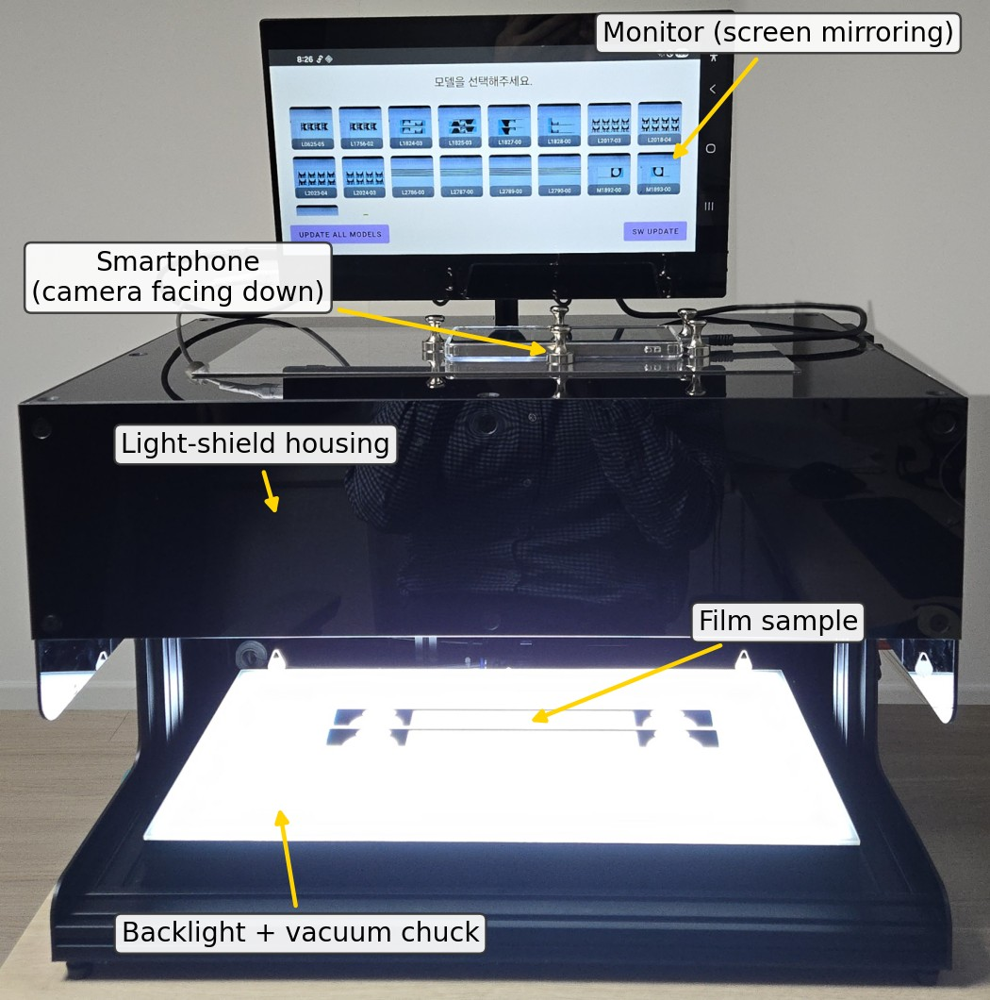

## 시스템 구성

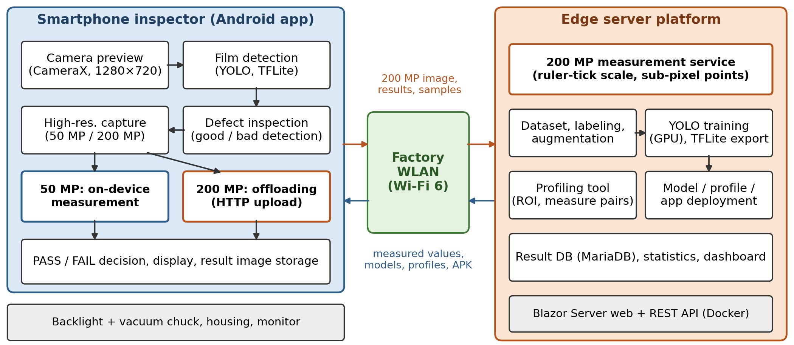

| 구분 | 구성 |
|------|------|
| 스마트폰 | Galaxy S25 Ultra (RAM 12 GB), 카메라가 아래를 향하도록 암막 하우징 상판에 고정 |
| 스테이지 | 진공척 내장 백라이트 (작업면 470 × 250 mm) — 필름 윤곽을 대비 높은 실루엣으로 |
| 표시 | 스마트폰 화면을 외부 모니터로 미러링 |
| 엣지 서버 | 공장 내 서버 (Core Ultra 9 285K, 64 GB, RTX 4090), 공장 내 무선 LAN(Wi-Fi 6)으로 연결 |
| 서버 플랫폼 | 모델 학습·증강, 측정 프로파일 작성, 모델·앱 배포, 결과 저장·통계 (ASP.NET Core 8 Blazor Server, MariaDB, Docker) |

## 동작 절차

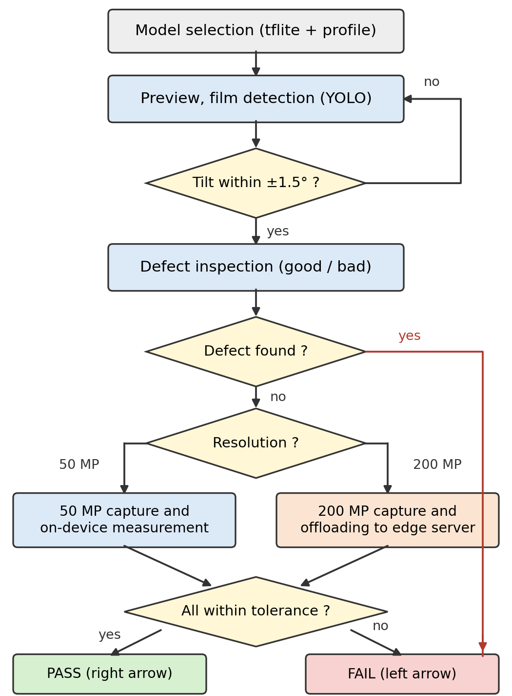

1. **품목 선택** — 품목별 검출 모델(tflite)과 측정 프로파일(JSON)을 불러옵니다.
2. **실시간 필름 검출·외관 검사** — CameraX 1280×720 프레임을 512×288로 줄여 YOLO11n(FP16, TFLite, CPU XNNPACK)으로
   3프레임마다 추론합니다(1회 41~48 ms). 필름(film)과 타공부 정상(good)·불량(bad)을 함께 검출하고,
   프레임별 결과를 누적(±4)해 합격·불합격을 확정합니다. 손·움직임이 보이면 판정을 보류하고, 기울기가 ±1.5° 이내일 때만 진행합니다.
3. **고해상도 촬영 연동** — CameraX로는 12.5 MP까지만 얻을 수 있어 제조사 카메라 앱을 호출합니다.
   50 MP는 기본 카메라 프로 모드(8160×4592), 200 MP는 Expert RAW(16320×12240)로 찍고,
   포그라운드 서비스가 새 사진을 감지하면 접근성 서비스로 앱에 자동 복귀합니다.
   촬영 조건은 ISO 50, 1/2000 s, 6000 K, 렌즈 왜곡 보정 ON으로 고정합니다.
4. **치수 측정** — 필름 영역을 다시 찾고 네 모서리 경계로 정밀하게 잡은 뒤, 프로파일에 정의된 ROI마다
   13가지 방법(직선·모서리·곡선·십자 표식 등) 중 하나로 서브픽셀 측정점을 뽑아 길이를 계산합니다.
5. **판정·저장** — 모든 항목이 허용 오차 이내이면 합격(오른쪽 화살표), 아니면 불합격(왼쪽 화살표).
   측정값은 결과 영상의 EXIF에 기록해 서버로 보냅니다.

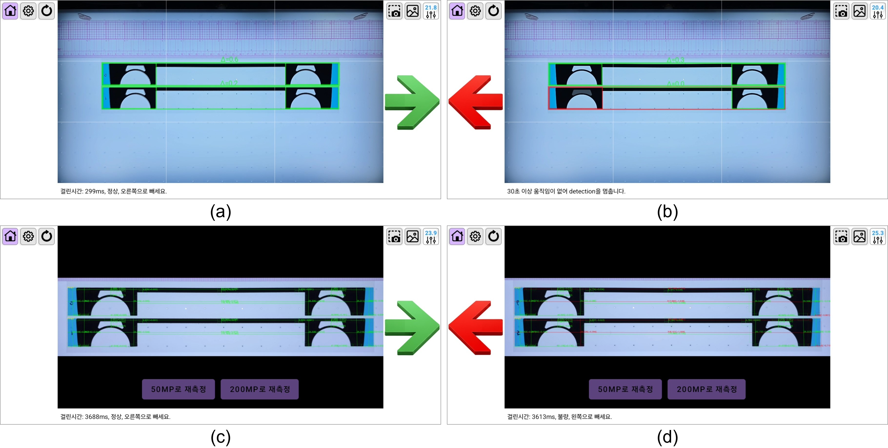

*(a) 외관 합격 (b) 외관 불합격 (c) 치수 합격 (d) 치수 불합격*

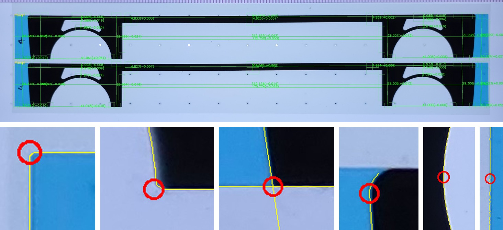

## 격자 기반 캘리브레이션

스마트폰 광각 카메라로 약 450 mm 폭을 근거리에서 찍으면 렌즈 왜곡과 원근 때문에 **화면 위치마다 배율이 달라집니다.**
5 mm 격자판으로 재 보면 50 MP에서 평균 18.11 px/mm(55.2 μm/px)지만 가로 방향으로 17.79~18.36 px/mm, **3.1%** 변합니다.

| 가로 방향 | 세로 방향 |
|:---:|:---:|
| 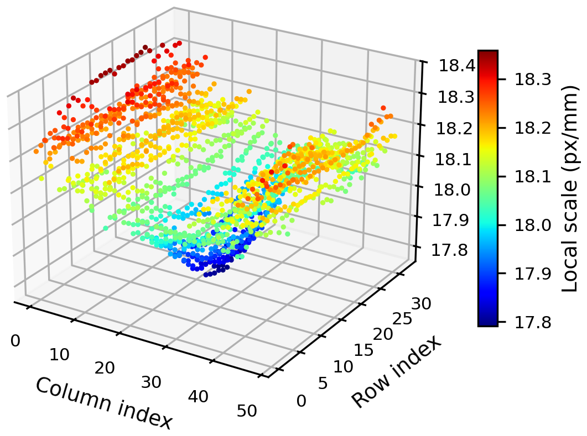 | 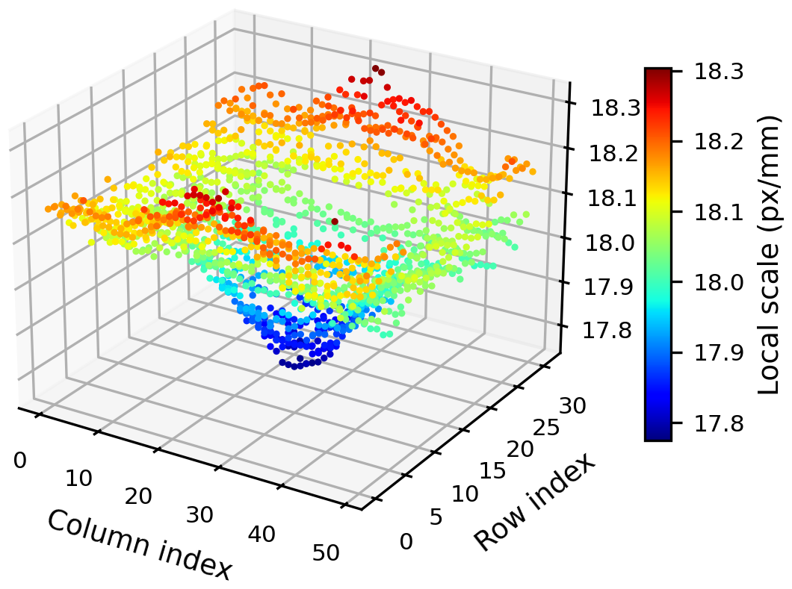 |

화면 전체에 배율 하나를 쓰면 격자점 오차가 RMS 0.24 mm, 최대 0.62 mm로 허용 오차(±0.15 mm)를 넘습니다.
그래서 측정 평면에서 직접 얻은 격자점으로 화소 좌표를 mm 좌표에 **구간별 아핀 변환**(Delaunay 삼각분할 + 무게중심 보간)으로 대응시킵니다.

**절차 (앱의 Update Grid)**
1. 격자판을 스테이지에 놓고 화면 안내에 따라 기울기를 ±1.5° 이내로 맞춥니다.
2. 50 MP로 촬영합니다.
3. 격자 간격 크기 타일마다 가로·세로 에지 에너지의 최대 위치를 무게중심으로 보정해 교차점을 서브픽셀로 찾습니다.
4. 이웃 간격의 평균·표준편차로 이상점을 검증·보정합니다.
5. 교차점의 화소·mm 좌표를 `Grid.json`으로 저장합니다. (스마트폰을 다시 장착하거나 초점 조건을 바꿀 때만 반복)

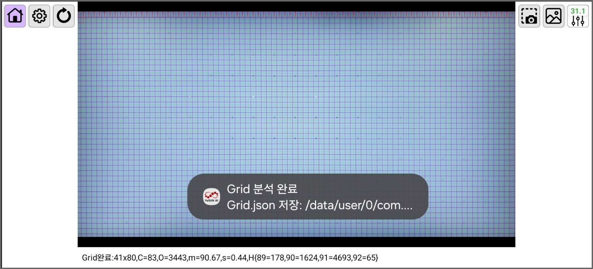

10 mm 간격 교차점만으로 변환을 만들고 나머지 교차점에서 검증하면, 오차가 50 MP에서 RMS 0.011 mm·최대 0.030 mm,
200 MP에서 RMS 0.012 mm·최대 0.045 mm로 단일 배율이나 전역 호모그래피의 1/10 이하입니다.

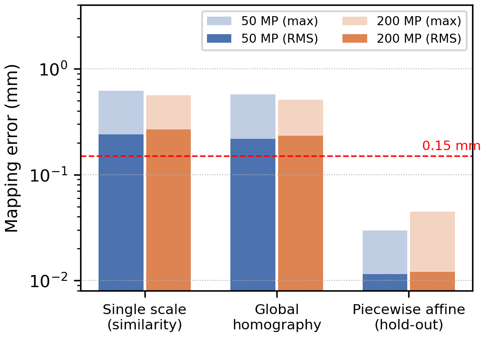

**온라인 오프셋 보정** — 재장착·조명 변화로 생기는 항목별 상수 편향을 양품 측정값으로 보정합니다:
`o ← o + α(g − (r + o))`. 처음 3장은 중앙값(α=1)으로 초기화하고 이후 지수 이동 평균(α=0.5)으로 갱신하며,
허용 오차 + 0.05 mm를 벗어난 값과 불합격 필름은 갱신에서 뺍니다. 설정에서 끌 수 있습니다.

## 단말-엣지 협력 처리 (50 MP / 200 MP)

| 항목 | 50 MP | 200 MP |
|------|-------|--------|
| 영상 크기 | 8160 × 4592 | 16320 × 12240 |
| 화소당 길이 | 55.2 μm | 27.7 μm |
| JPEG 크기(평균) | 4.7 MB | 30.1 MB |
| 복호 메모리(ARGB) | 150 MB | 799 MB |
| 촬영 앱 | 카메라(프로 모드) | Expert RAW |
| 배율 추정 | 격자 변환 | 눈금자 눈금 |
| 처리 위치 | **스마트폰** | **엣지 서버** |

매 검사에 쓰는 50 MP 측정은 스마트폰에서 처리하고, 정밀 재측정에 쓰는 200 MP 측정은 원본 JPEG을 HTTP로
공장 내 엣지 서버에 보내 처리합니다(이진 오프로딩). 앱 화면의 Retry 버튼을 짧게 누르면 50 MP, 길게 누르면 200 MP로 다시 잽니다.

## 성능

**측정 정확도** — 양산 필름을 본 시스템과 3차원 측정기(CMM)로 비교 (50 MP, 격자 변환 + 온라인 오프셋)

| 품목 | 항목 × 필름 | 도면 대비 최대 편차 | 항목별 표준편차 | CMM 대비 평균 차이 |
|------|------------|-------------------|----------------|-------------------|
| L1825-03 (3.1~145.37 mm) | 10 × 32 | 0.063 mm | 0.003~0.026 mm | 평균 0.024 mm |
| M2379-02 (최대 319.11 mm) | 21 × 30 | 0.099 mm | 0.003~0.038 mm | 평균 0.033 mm |

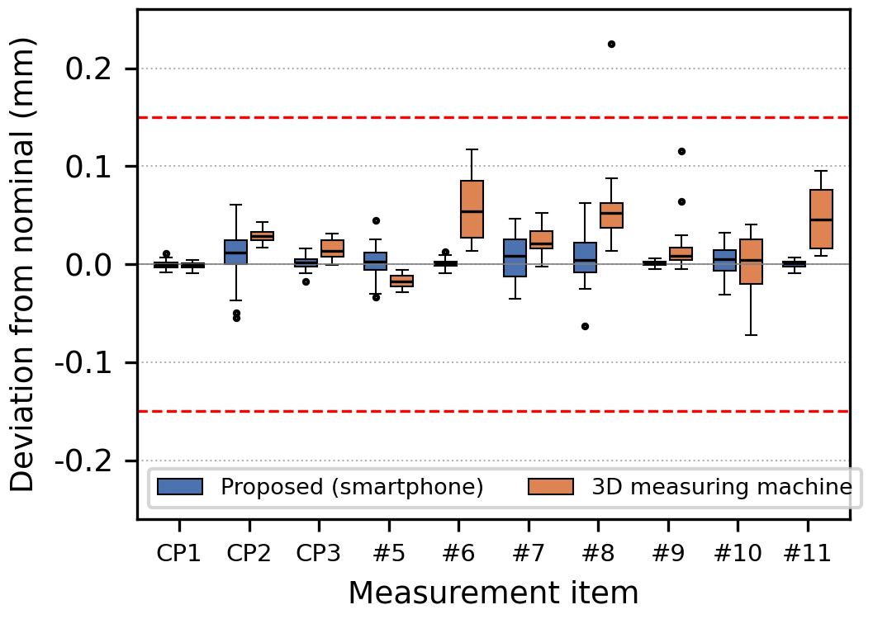

**처리 시간** (현장 반복 측정의 최소~최대)

| 구분 | 50 MP 온디바이스 | 200 MP 온디바이스 | 200 MP 오프로딩 |
|------|-----------------|------------------|----------------|
| 그 밖의 단계(외관 검사·촬영·저장·앱 전환) | 3.0~3.3 s | 4~6 s | 4~6 s |
| 전송 (공장 내 Wi-Fi 6) | – | – | 0.8 s |
| 측정 연산 | 0.4~0.6 s | 2~3 s | 0.3~0.5 s |
| **검사 주기** | **3.6~3.7 s** | 7~9 s | 5.1~7.3 s |

**연속 운전** — 실제 운전 조건(실시간 검사 + 50 MP 촬영·측정 반복)으로 8.8시간 운전.
4.5분 뒤 33.1 °C에서 발열 상태 1단계(경미한 제한)에 들어갔지만 이후 35.2 °C를 넘지 않았고 2단계 이상으로는 가지 않았습니다.

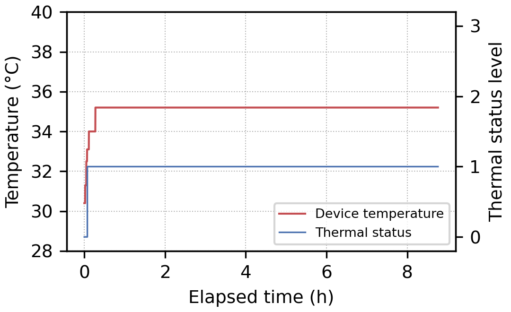

## 주요 기능

### 실시간 AI 검사
- **YOLO 객체 탐지**: TFLite 기반 YOLO11 모델로 필름(film), 양품(good), 불량(bad) 실시간 분류
- **Good/Bad 판정 엔진**: 프레임별 결과를 누적해 ±4에 도달하면 합격·불합격 확정
- **필름 트래킹**: 배출 방향을 추적해 잘못 배출하면 경고
- **모션/핸드 감지**: 손·움직임이 보이면 판정 보류
- **음향 피드백**: 양품(pass), 불량(fail), 성공(success), 에러(error) 판정음

### 치수 측정
| 방식 | 설명 |
|------|------|
| **Grid (기본)** | Grid.json 기반 구간별 아핀 변환으로 픽셀→mm 변환. 온라인 오프셋 보정 지원 |
| **Ruler** | 자(ruler)의 눈금(tick) 검출 후 px/mm 추정. 200 MP 측정에 사용 |

- **50MP / 200MP 스케일링**: 촬영 해상도에 따라 측정 파라미터 자동 조정 (200MP = 2배 스케일)
- **측정값 저장**: 결과 이미지의 EXIF UserComment에 측정값 메타데이터 기록

### 삼성 카메라 연동
- **Samsung Camera Pro** (50MP) 및 **Expert RAW** (200MP) 앱 연동 촬영
- 프록시 Activity를 통한 카메라 실행 및 이미지 수신
- **자동 복귀**: Foreground Service + Accessibility Service로 촬영 후 앱 자동 복귀

### 모델 관리
- 서버에서 YOLO 모델 다운로드 및 업데이트, 모델 레지스트리로 다중 모델 관리
- 모델별 프로파일 JSON 설정, 앱(APK) 자동 업데이트

### 갤러리 및 결과 관리
- 폴더 기반 결과 이미지 브라우징 (DCIM/Result, 내부 저장소), Zoom/Pan 이미지 뷰어
- EXIF 측정값 조회, 내부 모델/JSON 파일 브라우저, 결과 이미지 서버 업로드

## 앱 화면 구성

모든 화면은 **가로(Landscape) 고정** 방향입니다.

| 화면 | 설명 |
|------|------|
| **ModelSelectActivity** | 런처. 모델 선택/다운로드, SW 업데이트, 저장공간 경고 |
| **MainActivity** | 메인 카메라 프리뷰 + YOLO 추론 오버레이 + 측정 워크플로우 |
| **SettingsActivity** | 오버레이 토글, MP 선택, 측정 방식, 파이프라인 모드 설정 |
| **ModelUpdateActivity** | 설치된 모델 목록 관리 (업데이트/삭제) |
| **Gallery 화면들** | 폴더 브라우저 → 이미지 그리드 → 이미지 뷰어 / 측정값 뷰어 |
| **StatusActivity** | 상태 정보 표시 |

## 아키텍처

전통적인 MVVM/MVI 대신 **파이프라인 기반 아키텍처**를 사용합니다.

```
CameraPipeline ──→ InferencePipeline ──→ MeasurementPipeline
  (CameraX 바인딩,     (YOLO 탐지,          (삼성 촬영 이미지 처리,
   프레임 전달,         모션/핸드 감지,        Grid/Ruler 측정,
   플리커 완화)         방향 검사,            EXIF 메타데이터,
                      오버레이 렌더링)       결과 저장/업로드)
```

### 상태 관리 (`pipeline/state/`)
- **AppRuntimeState**: UI 상태 (프리뷰 일시정지, 알림, 오버레이 등)
- **AppSessionSettings**: 세션 설정 스냅샷 (앱 종료 시 리셋)

### 주요 패키지

| 패키지 | 역할 |
|--------|------|
| `pipeline/` | Camera, Inference, Measurement 파이프라인 및 AutoReturn 관리 |
| `film/` | 필름 검출 및 측정 로직. Grid 기반(`FilmTotalMeasureGridProcessor`) / Ruler 기반(`FilmTotalMeasureProcessor`) |
| `film/ruler/` | 자(ruler) 눈금 검출(`TickDetector`), 캘리브레이션, 거리 계산(`PyMath`) |
| `grid/` | 그리드 검출, 구간별 아핀 워핑(`GridWarpPiecewiseAffine`), 워프 캐시 |
| `calibration/` | 온라인 오프셋 캘리브레이션 |
| `inspection/` | Good/Bad 판정 엔진, 필름 트래킹, 모션/핸드 감지, 사운드 플레이어 |
| `yolo/` | TFLite YOLO 추론(`YoloDetector`), 클래스 매핑(film/good/bad) |
| `model/` | 모델 레지스트리, 서버 다운로드, 파일 저장, 선택/업데이트 UI |
| `samsungcapture/` | 삼성 카메라 프록시, 캡처 계약, 자동 복귀 |
| `cv/` | OpenCV 이미지 처리 |
| `net/` | OkHttp 기반 업로드 클라이언트 (결과/파일 → 서버) |
| `gallery/` | 결과 브라우징, 이미지 뷰어, EXIF 측정값 표시 |

## 기술 스택

| 구분 | 기술 | 버전 |
|------|------|------|
| 언어 | Kotlin | 2.0.21 |
| 빌드 | Gradle (Kotlin DSL) | 8.13 |
| Min SDK | Android 8.0 | API 26 |
| Target SDK | Android 14 | API 34 |
| UI | XML Layouts + View Binding | - |
| 카메라 | AndroidX CameraX | 1.3.4 |
| ML 추론 | TensorFlow Lite | 2.12.0 |
| 이미지 처리 | OpenCV | 4.12.0 |
| 네트워크 | OkHttp3 | 4.12.0 |
| 이미지 로딩 | Coil | 2.6.0 |
| 비동기 | Kotlin Coroutines | 1.7.3 |
| UI 프레임워크 | Material Design 3 | 1.12.0 |

## 빌드

```bash
# 디버그 APK 빌드
./gradlew assembleDebug

# 릴리즈 APK 빌드
./gradlew assembleRelease

# 연결된 디바이스에 설치
./gradlew installDebug
```

## 설정 옵션

`GlobalParams.kt`에서 전역 파라미터를 관리합니다.

### YOLO 설정
| 파라미터 | 기본값 | 설명 |
|---------|--------|------|
| SCORE_THRESH | 0.9 | YOLO confidence 임계값 |
| GOOD_BAD_SCORE_THRESH | 0.5 | Good/Bad 판정 임계값 |
| IOU_THRESH | 0.7 | NMS IoU 임계값 |
| YOLO_INTERVAL | 3 | YOLO 추론 간격 (1~10 프레임) |

### 파이프라인 모드
| 모드 | 옵션 | 기본값 |
|------|------|--------|
| MeasureMode | NONE / MANUAL / AUTO | AUTO |
| MeasurementMethod | GRID / RULER | GRID |
| TiltMode | NONE / HOUGH | NONE |

### 기타 기본 설정
| 항목 | 기본값 |
|------|--------|
| Capture MP | 50 |
| Offset Calibration | ON |
| Upload to Server | ON |
| Save Result | ON |
| Direction Check | ON |
| Storage Warning | 80% |

## 권한

| 권한 | 용도 |
|------|------|
| `CAMERA` | 실시간 카메라 프리뷰 및 YOLO 추론 |
| `FOREGROUND_SERVICE` | 삼성 카메라 촬영 감지 및 자동 복귀 서비스 |
| `POST_NOTIFICATIONS` | 포그라운드 서비스 알림 |
| `READ_MEDIA_IMAGES` | 갤러리 결과 이미지 접근 |
| `INTERNET` | 모델 다운로드 및 결과 업로드 |
| `REQUEST_INSTALL_PACKAGES` | APK 자동 업데이트 |

## 서버 연동

서버(`GlobalParams.YESUNAI_BASE_URL`)와 연동하여 다음 기능을 제공합니다:
- YOLO 모델(.tflite) 및 프로파일(.json) 다운로드
- 모델 목록 조회 (`/api/files/list-runs?scope=ruler`)
- 검사 결과 이미지 업로드 (`/api/ruler/upload-results`)
- APK 업데이트 다운로드 (`/ruler/releases/AIRuler.apk`)
